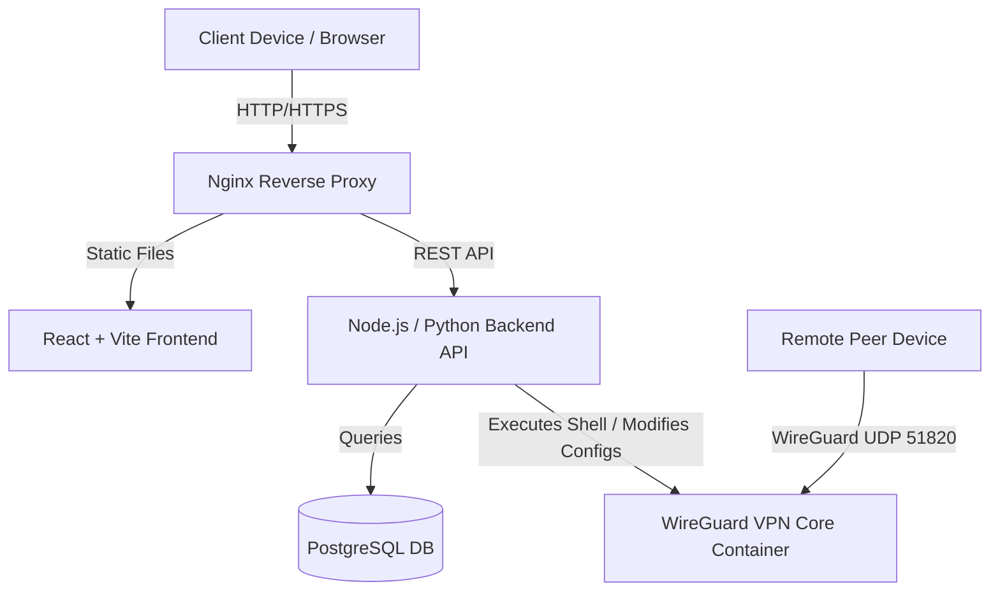

# Design Document: PT57 Enterprise VPN Server with Administration Portal (Frontend & Full Project Spec)

**Date**: 2026-05-25  
**Project Title**: PT57 : Serveur VPN d’Entreprise avec Portail d’Administration  
**Status**: APPROVED by User  

---

## 1. System Architecture

To ensure a clean separation of concerns and production readiness, we will organize the full project into a multi-service monorepo structure. This allows deployment using Docker Compose, where the Frontend, Backend, Database, and VPN Core services run in isolated containers.

### High-Level Component Architecture


---

## 2. Full Project Folder Structure

The following monorepo directory layout establishes clean bounds between Frontend assets, API routes, and VPN configuration tooling:

```text
pt57-vpn-portal/
├── docker-compose.yml           # Core Docker deployment orchestrator
├── docs/                        # Context and high-level design specifications
│   ├── PROJECT_MISSION.md
│   ├── SYSTEM_ARCHITECTURE.md
│   ├── FEATURES_DETAILED.md
│   ├── UI_UX_DESIGN.md
│   ├── TECHNICAL_SPECIFICATIONS.md
│   └── PROJECT_PLANNING.md
│
├── projectfe/                   # Frontend React + Vite Admin Web Portal
│   ├── package.json
│   ├── vite.config.ts
│   ├── tailwind.config.js
│   ├── tsconfig.json
│   ├── index.html
│   ├── src/
│   │   ├── main.tsx
│   │   ├── index.css            # Base Tailwind and visual styles (Glassmorphism, variables)
│   │   ├── assets/              # SVG logos and icons
│   │   ├── components/          # Reusable UI component blocks (mimicking Shadcn/UI)
│   │   │   ├── ui/              # Base atoms: Button, Input, Table, Badge, Card, Dialog
│   │   │   ├── layout/          # Sidebar, Navbar, PageWrapper
│   │   │   └── widgets/         # Charts, LivePeerCard, StatusIndicator
│   │   ├── context/             # Global stores (Zustand state store for users, peers, logs)
│   │   ├── hooks/               # Custom hooks (e.g., useAuth, useStats)
│   │   ├── services/            # Axios API client integrations
│   │   └── pages/               # Main portal pages (Login, Dashboard, Users, Devices, etc.)
│
├── backend/                     # Backend API (Node.js/Express or Python/FastAPI)
│   ├── package.json
│   ├── src/
│   │   ├── index.ts             # App entry point
│   │   ├── controllers/         # Request handling logic
│   │   ├── middleware/          # JWT authentication and Role-Based Access Control
│   │   ├── models/              # Prisma / SQLAlchemy Database Schemas
│   │   └── routes/              # Express / FastAPI Route definitions
│   └── Dockerfile
│
└── vpn-core/                    # WireGuard Core Configuration & Shell Automation
    ├── config/                  # Server configuration keys and templates
    ├── templates/               # Client config template
    └── scripts/                 # Automated bash scripts (add_peer.sh, remove_peer.sh, check_status.sh)
```

---

## 3. Database Schema Specification (PostgreSQL)

Prisma-style schema definitions modeling our enterprise-grade users, active devices/peers, bandwidth connections, firewall rules, and action trail.

```prisma
// 1. User Management (Admin Dashboard Users & Organization Staff)
model User {
  id            String         @id @default(uuid())
  email         String         @unique
  passwordHash  String
  fullName      String
  role          Role           @default(ADMIN) // SUPER_ADMIN, ADMIN, USER (Auditor)
  departmentId  String?
  department    Department?    @relation(fields: [departmentId], references: [id])
  peers         Peer[]         // WireGuard devices owned by this user
  auditLogs     AuditLog[]
  createdAt     DateTime       @default(now())
  updatedAt     DateTime       @updatedAt
}

enum Role {
  SUPER_ADMIN
  ADMIN
  AUDITOR
}

model Department {
  id          String   @id @default(uuid())
  name        String   @unique // e.g., "Engineering", "Marketing"
  description String?
  users       User[]
  policies    Policy[] // Policies attached directly to this department
  createdAt   DateTime @default(now())
}

// 2. VPN Peer / Client Configuration
model Peer {
  id            String          @id @default(uuid())
  name          String          // Friendly device name (e.g., "John's MacBook Pro")
  userId        String
  user          User            @relation(fields: [userId], references: [id], onDelete: Cascade)
  publicKey     String          @unique
  privateKeyEnc String          // Encrypted private key (stored safely if generated by server)
  allowedIPs    String          // allocated IP, e.g., "10.8.0.2/32"
  endpoint      String?         // Last known public IP + Port of connection
  isActive      Boolean         @default(true)
  lastHandshake DateTime?       // Timestamp of last WireGuard handshake
  txBytes       BigInt          @default(0) // Cumulative transmitted bytes
  rxBytes       BigInt          @default(0) // Cumulative received bytes
  createdAt     DateTime        @default(now())
  updatedAt     DateTime        @updatedAt
  connectionLogs ConnectionLog[]
}

// 3. Live Monitoring & Statistics
model ConnectionLog {
  id            String    @id @default(uuid())
  peerId        String
  peer          Peer      @relation(fields: [peerId], references: [id], onDelete: Cascade)
  connectedAt   DateTime  @default(now())
  disconnectedAt DateTime?
  rxBytes       BigInt    @default(0) // Bytes received during this specific session
  txBytes       BigInt    @default(0) // Bytes sent during this specific session
  ipAddress     String    // Public IP the peer connected from
}

// 4. Access Control & Firewall Policies
model Policy {
  id            String      @id @default(uuid())
  name          String
  ruleType      RuleType    @default(ALLOW) // ALLOW or BLOCK
  targetSubnet  String      // e.g., "192.168.1.0/24" (Restricted local subnet)
  port          Int?        // Optional specific port
  departmentId  String?
  department    Department? @relation(fields: [departmentId], references: [id], onDelete: Cascade)
  createdAt     DateTime    @default(now())
}

enum RuleType {
  ALLOW
  BLOCK
}

// 5. System Security Auditing
model AuditLog {
  id         String   @id @default(uuid())
  userId     String?  // Action executor (null if automated system action)
  user       User?    @relation(fields: [userId], references: [id])
  action     String   // e.g., "CREATE_PEER", "REVOKE_PEER", "DELETE_USER"
  details    String   // JSON string details of change
  ipAddress  String   // Administrator's public IP
  createdAt  DateTime @default(now())
}
```

---

## 4. API Routes Specification

All endpoints are secured via JWT authorization headers and enforce RBAC checks on write methods.

| Method | Endpoint | Description | Auth Role Required |
|---|---|---|---|
| **POST** | `/auth/login` | Authenticate admin, return JWT cookie/token | Public |
| **POST** | `/auth/logout` | Invalidate current session | Authenticated |
| **GET** | `/auth/me` | Return currently logged-in administrator's profile | Authenticated |
| **GET** | `/users` | List all portal & VPN users | ADMIN, SUPER_ADMIN |
| **POST** | `/users` | Create a new user / admin | SUPER_ADMIN |
| **PUT** | `/users/:id` | Update user details or change role | SUPER_ADMIN |
| **DELETE** | `/users/:id` | Remove a user and revoke all their peers | SUPER_ADMIN |
| **GET** | `/peers` | List all WireGuard peers (with active handshake status) | AUDITOR, ADMIN |
| **POST** | `/peers` | Generate new WireGuard keys, allocate IP, and create peer | ADMIN, SUPER_ADMIN |
| **GET** | `/peers/:id/config` | Generate and download `.conf` file content | ADMIN, SUPER_ADMIN |
| **GET** | `/peers/:id/qrcode` | Get QR Code URL representing connection setup | ADMIN, SUPER_ADMIN |
| **PUT** | `/peers/:id/status` | Revoke (deactivate) or reactivate a peer instantly | ADMIN, SUPER_ADMIN |
| **DELETE** | `/peers/:id` | Remove peer completely from WireGuard server | ADMIN, SUPER_ADMIN |
| **GET** | `/stats/overview` | Fetch total peers, live connected peers, system CPU/RAM, dynamic data traffic | AUDITOR, ADMIN |
| **GET** | `/stats/traffic` | Historical bandwidth usage series (for charting) | AUDITOR, ADMIN |
| **GET** | `/logs/connections` | View live and historical peer connection logs | AUDITOR, ADMIN |
| **GET** | `/logs/audit` | View detailed admin operational trail | SUPER_ADMIN |

---

## 5. UI/UX Page Flow & Styling Specs

We utilize a tailored dark-mode ecosystem using Tailwind CSS v3 for consistent dashboard utility styling.

### 5.1 Color Palette & Theme Tokens
- **Background**: obsidian `#0B0F19` with a subtle gradient to `#111827`.
- **Containers**: slate-surface `#161B26` with `bg-opacity-65 backdrop-blur-md border border-white/5` glassmorphic traits.
- **Active State (Connected)**: dynamic emerald `#10B981` with double pulse ring animation.
- **Inactive/Offline State**: medium gray `#6B7280`.
- **Error/Revoked State**: vivid ruby `#EF4444`.
- **Amber Warning Accents**: `#F59E0B`.

### 5.2 Responsive Core Layout
- **Desktop Sidebar Navigation**: Fixed Left-hand persistent side menu containing logo branding, page links (Dashboard, Users, Peers, Logs, Settings), current system clock, and Admin user metadata profile widget.
- **Responsive Header**: Mobile collapsible burger menu and live notifications widget.

### 5.3 Page Breakdowns
1. **Login Page (`/login`)**:
   - High-contrast central glass container over animated ambient gradients.
   - Form inputs with clear transitions and error prompts.
2. **Dashboard (`/dashboard`)**:
   - Real-time stat cards with live numeric tickers.
   - Graphical system load meters (CPU/RAM circular dials).
   - Ingress/egress bandwidth traffic line graphs powered by **Recharts**.
3. **Users & Departments (`/users`)**:
   - Interactive table detailing all organization members.
   - Expandable sliders and modals to assign departments and role access thresholds.
4. **Devices & Peers Console (`/peers`)**:
   - Visual card deck showing device types, allotted server IP address allocation, and handshake data rates.
   - Key interactions: Generate Config, Show QR Code Scanner Modal, Revoke VPN Client slider toggle.
5. **Logs & Security Audit Trails (`/logs`)**:
   - Filtering filters classifying INFO, WARN, and CRIT event logs.
   - Actions to trigger CSV reports export.
6. **System Configurations (`/settings`)**:
   - Admin settings adjusting server networks and ports.
